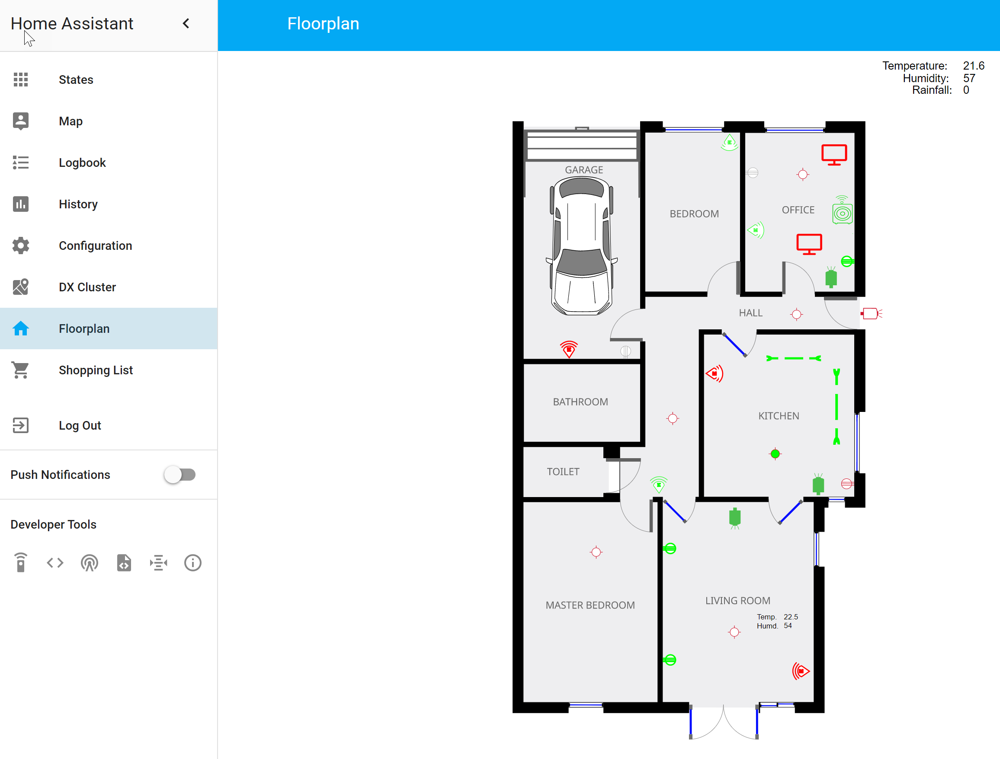

# Home Automation #

My configuration files for Home Assistant

## ScreenShots ##

## Hardware used ##

+ Raspberry Pi
+ Pi Official touch screen
+ [Pi Case](https://www.amazon.co.uk/SmartPi-Raspberry-Pi-Touchscreen-Enclosure/dp/B01MSH74DB)
+ [Home Assistant](https://home-assistant.io/)
+ [HomeBridge](https://github.com/nfarina/homebridge)
+ [Z-Wave Z-Stick Gen5](https://www.amazon.co.uk/gp/product/B00YETCNOE/)
+ [Neo Cool Cam Z-wave Water/Flood Sensor](https://www.amazon.co.uk/gp/product/B06XKN3X3F)
+ [TP Link HS110 Smart Plugs](https://www.amazon.co.uk/gp/product/B01IBUF48S/)
+ [Aeon Labs Multisensor 6 - Z-Wave Plus](https://www.amazon.co.uk/gp/product/B0141FQDJQ/)
+ [TP-Link NC450 PTZ Cameras](https://www.amazon.co.uk/gp/product/B01MDPCE6B/)
+ [Neo Cool Cam Z-wave Door/Window Sensor](https://www.amazon.co.uk/gp/product/B06XKQFQGN/)
+ [AEON ZW120 Gen5 Door and Window Sensor ](https://www.amazon.co.uk/gp/product/B0171GLI5Q/)
+ [Philips Hue Hub](https://www.amazon.co.uk/Philips-Personal-Wireless-Lighting-Automation/dp/B0152WXHVE/)
+ [Philips Hue Intelligent Motion Sensor](https://www.amazon.co.uk/Philips-Intelligent-Wireless-Lighting-Accessory/dp/B01KLWXL5C/)
+ [Philips Hue White and Colour Ambiance ](https://www.amazon.co.uk/Philips-Ambiance-Wireless-Lighting-Bayonet/dp/B01LVUZQNX/)
+ [ESP8266](https://www.adafruit.com/product/2471)
+ [XCSOURCE LD686 RGB LED Strip Controller](https://www.amazon.co.uk/gp/product/B01AA6221S/)
+ [E-JIAEN LED Strip 300LEDs SMD3528 RGB LED](https://www.amazon.co.uk/gp/product/B01HXXWP3G/)
+ [Ring Doorbell](https://ring.com/)
+ [Netatmo Weather Station](https://www.amazon.co.uk/gp/product/B01084QX9Y/)
+ [Netatmo Rain Gauge](https://www.amazon.co.uk/gp/product/B00J5OHDGG/)
+ [Netatmp Wind Gauge](https://www.amazon.co.uk/gp/product/B016OHME1A/)
+ [Netatmo Healthy Home Coach](https://www.amazon.co.uk/Netatmo-Healthy-Indoor-Climate-Monitor/dp/B01M67SMOZ/)
+ [Sonos Play 5](http://www.sonos.com/en-gb/home)
+ [Google Chromecast](https://www.google.com/intl/en_uk/chromecast/)
+ [Amazon Echo Show](https://www.amazon.co.uk/Introducing-Echo-Show-Black-Now-Alexa-Can-Show-You-Things/dp/B01KGEWACK)
+ [Amazon Echo's](https://www.amazon.co.uk/Amazon-SK705DI-Echo-Black/dp/B01GAGVIE4)
+ [Amazon Dot's](https://www.amazon.co.uk/Amazon-Echo-Dot-Generation-Black/dp/B01DFKBL68/)
+ [Google Home](https://madeby.google.com/home/)
+ [Google Home Mini](https://madeby.google.com/home/)
+ [Broadlink RM Mini 3](https://www.amazon.co.uk/gp/product/B01HPWMWCY/)
+ [Broadlink RM Pro](https://www.amazon.co.uk/d/Home-Audio-Video-Accessories/Broadlink-Automation-Learning-Universal-Control-Compatible-Smartphones/B01H6Y55QQ/)
+ [IPS Touch Screen](https://www.amazon.co.uk/gp/product/B073XDVX7R/)
+ [Power Line Adapters](https://www.amazon.co.uk/gp/product/B06XKKRDVR/)
+ [Control 4](https://www.control4.com/)
+ [Lifx Bulbs](https://uk.lifx.com/)
+ [Smarter Coffee Machine](https://smarter.am/coffee/)
+ [Logitech Harmony Remote](https://www.logitech.com/en-gb/harmony-universal-remotes)

## Software/Plugins Used ##

+ [Raspbian](https://www.raspbian.org/) 
+ [Home Assistant FloorPlan](https://github.com/pkozul/ha-floorplan)
+ [Lets Encrypt](https://home-assistant.io/docs/ecosystem/certificates/lets_encrypt/)
+ [fail2ban](https://www.fail2ban.org/wiki/index.php/Main_Page)
+ [Mosquitto](https://mosquitto.org/)
+ [MagicPlan](http://www.magic-plan.com/magicplan/)
+ [InkScape](https://inkscape.org/en/)